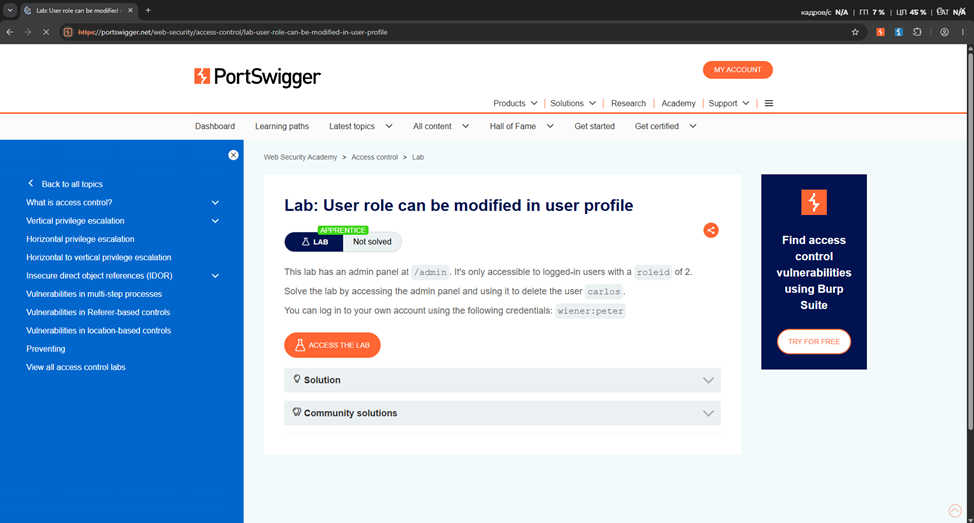
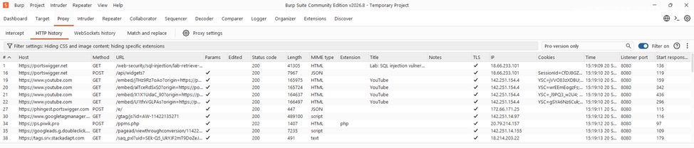
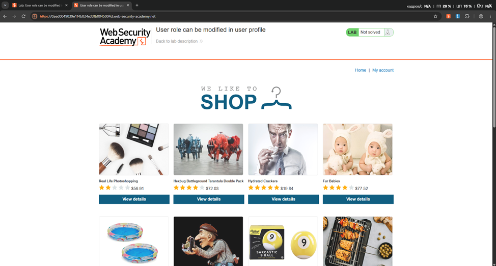
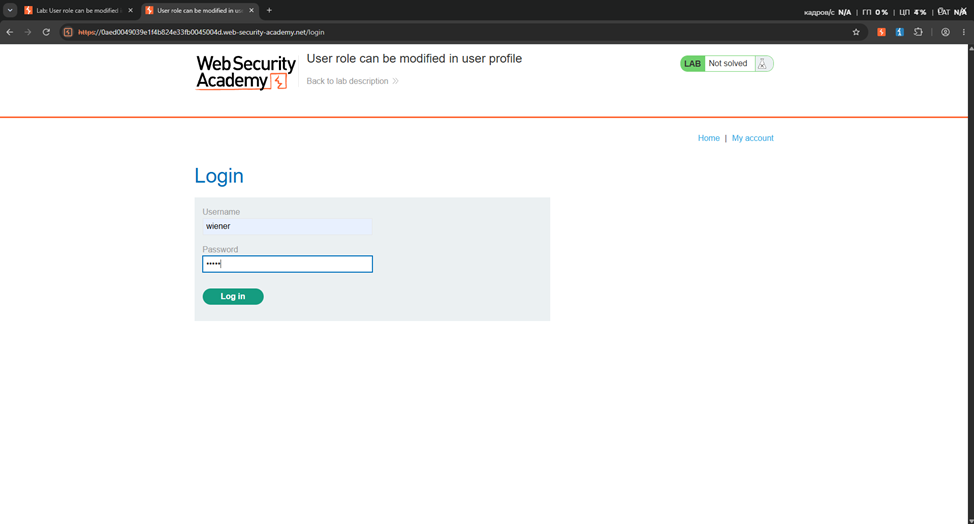
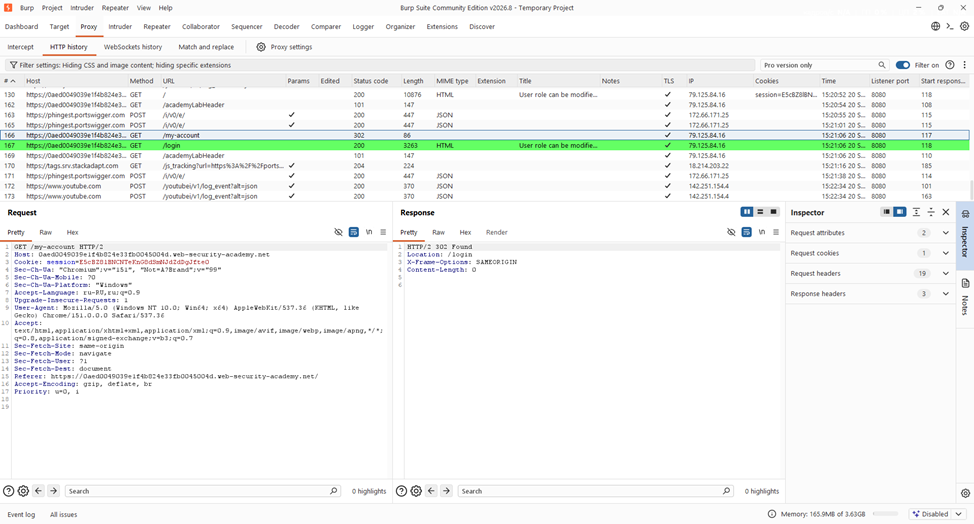
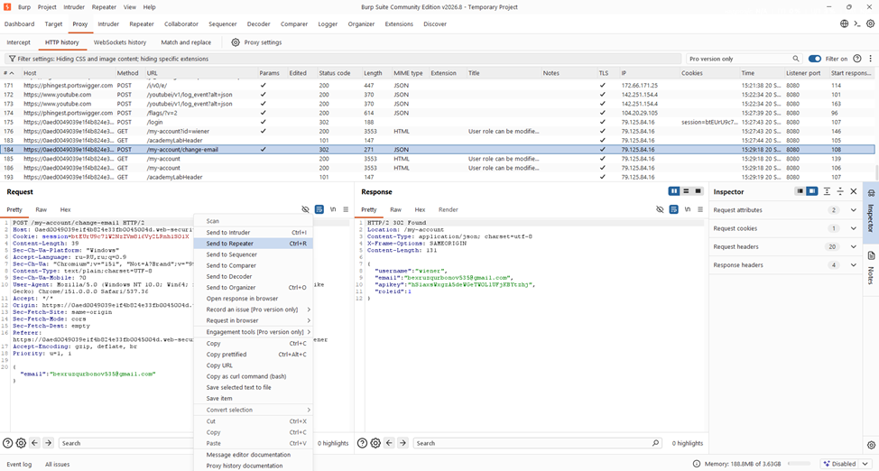
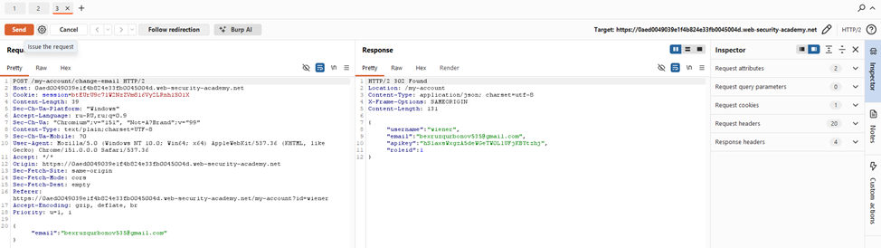
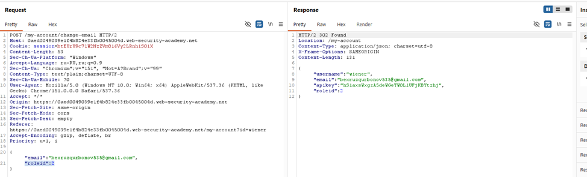
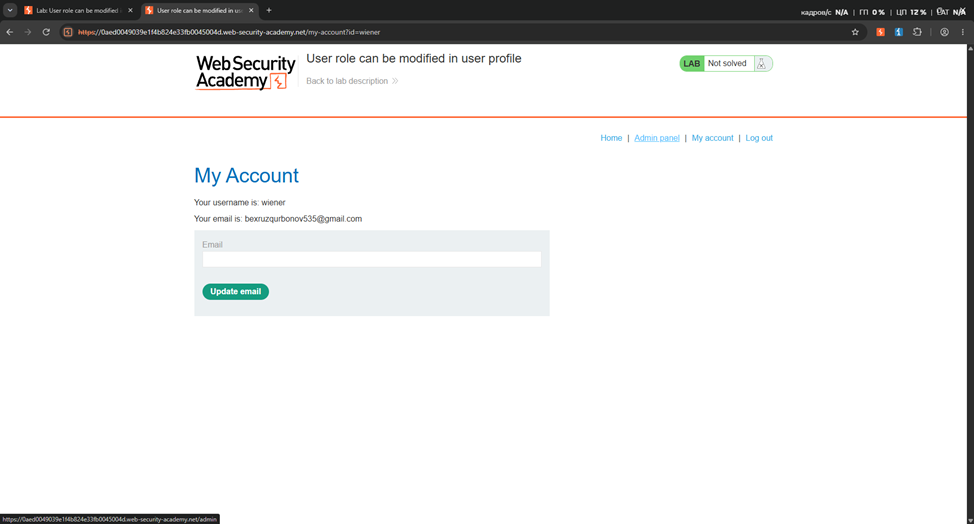
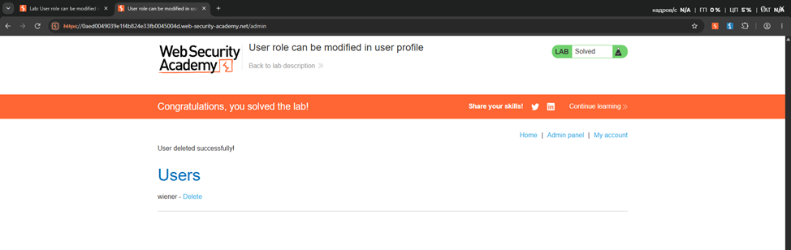

# PortSwigger Lab — User role can be modified in user profile

## Maqsad

Ushbu laboratoriya **Broken Access Control / Privilege Escalation** mavzusiga tegishli. Vazifa oddiy foydalanuvchi profilini yangilash so‘rovida yuboriladigan ma’lumotlarni tahlil qilib, foydalanuvchi rolini o‘zgartirish va administrator paneliga kirishni tekshirishdan iborat.

> Ushbu ish faqat PortSwigger Web Security Academy o‘quv laboratoriyasida bajarilgan.

---

## 1. Laboratoriyani ishga tushirish

Avval PortSwigger Web Security Academy saytida **User role can be modified in user profile** laboratoriyasi ochildi.



---

## 2. Burp Suite orqali trafikni kuzatish

Laboratoriya Burp Suite ichidagi brauzer orqali ochildi. `Proxy -> HTTP history` bo‘limida saytga yuborilayotgan HTTP so‘rovlar kuzatildi.


HTTP history orqali laboratoriyaga tegishli so‘rovlar ajratib olindi.



---

## 3. Saytga kirish

Laboratoriya do‘kon sahifasi ochildi.



Keyin laboratoriya tomonidan berilgan oddiy foydalanuvchi akkaunti orqali tizimga kirildi.



---

## 4. Profil ma’lumotini o‘zgartirish

`My account` bo‘limida email manzilini yangilash amali bajarildi. Natijada quyidagi endpointga so‘rov yuborildi:

```http
POST /my-account/change-email
```

Bu so‘rov `Proxy -> HTTP history` ichida topildi.



Javobdagi JSON ma’lumotlar orasida foydalanuvchining roli ham qaytarilayotgani ko‘rindi:

```json
{
  "username": "wiener",
  "email": "...",
  "apikey": "...",
  "roleid": 1
}
```

Bu yerda `roleid` foydalanuvchi huquq darajasini ko‘rsatadi.

---

## 5. So‘rovni Burp Repeater'ga yuborish

`/my-account/change-email` so‘rovi ustida o‘ng tugma bosilib **Send to Repeater** tanlandi.



Repeater orqali so‘rovni qayta yuborish va uning body qismini tahrirlash imkoniyati olindi.



---

## 6. `roleid` qiymatini o‘zgartirish

Dastlab request body ichida faqat email yuborilayotgan edi. So‘rovga `roleid` parametri qo‘shildi va administrator roliga mos qiymat yuborildi.

Misol:

```json
{
  "email": "user@example.com",
  "roleid": 2
}
```

So‘rov qayta yuborilgandan keyin server foydalanuvchi rolini yangiladi.



---

## 7. Administrator huquqini tekshirish

Brauzerga qaytib `My account` sahifasi yangilanganda menyuda yangi **Admin panel** havolasi paydo bo‘ldi.



Bu foydalanuvchining huquqi oddiy foydalanuvchidan administrator darajasiga o‘zgarganini ko‘rsatdi.

---

## 8. Laboratoriyani yakunlash

Administrator paneli ochildi va laboratoriya vazifasida ko‘rsatilgan foydalanuvchi o‘chirildi. Shundan so‘ng PortSwigger laboratoriyani **Solved** holatiga o‘tkazdi.



---

## Xulosa

Laboratoriyada profilni yangilash endpointi foydalanuvchi yuborgan JSON parametrlarini yetarlicha cheklamasligi ko‘rsatildi. Oddiy foydalanuvchi `roleid` maydonini request body ichiga qo‘shib, o‘z rolini administrator darajasiga o‘zgartira oldi.

Bu zaiflik **Mass Assignment** va **Broken Access Control** bilan bog‘liq. Server foydalanuvchidan kelgan role kabi xavfsizlikka ta’sir qiluvchi maydonlarni to‘g‘ridan-to‘g‘ri qabul qilmasligi kerak.
